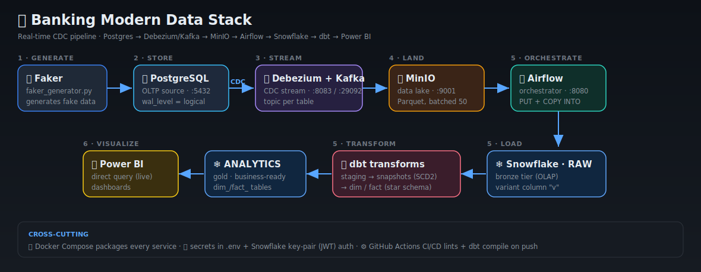

# 🏦 Banking Modern Data Stack — The Complete Guide

> **One place for everything.** Architecture, every folder, every line of code explained,
> the concepts behind it, the commands we ran, the bugs we fixed, and interview questions.
> Written for a complete beginner aiming to become a **Senior Data Engineer**.

**Pipeline:** `Postgres → Debezium/Kafka (CDC) → MinIO (lake) → Airflow → Snowflake → dbt → Power BI`

📄 *Companion file:* [`COMMANDS_JOURNEY.md`](COMMANDS_JOURNEY.md) — the pure command/troubleshooting log.
🌐 *Interactive view:* open [`index.html`](index.html) in a browser.

---

## 📑 Contents
1. [What & Why](#what)
2. [Architecture & Data Flow](#arch)
3. [Tech Stack — and why each tool](#stack)
4. [Folder-by-Folder](#folders)
5. [Stage 1–2 · Source (Postgres + Faker)](#source)
6. [Stage 3–4 · CDC (Debezium + Kafka + Consumer)](#cdc)
7. [Stage 5 · Airflow (the DAGs)](#airflow)
8. [Stage 5 · dbt (staging → snapshots → marts)](#dbt)
9. [Stage 6 · Snowflake objects](#snowflake)
10. [Infrastructure & CI/CD](#infra)
11. [Concepts Glossary](#glossary)
12. [Interview Questions](#interview)
13. [Top 10 Lessons](#lessons)
14. [🔌 Ports & URLs — what's where](#ports)
15. [🖥️ Exploring Every Tool (click-by-click)](#explore)
16. [🧭 Follow ONE row through the pipeline](#trace)

---

<a name="what"></a>
## 1. What & Why

A bank has two opposite needs:

| Need | Example | System | Tech |
|---|---|---|---|
| **Run the bank** (fast writes) | "record this transfer NOW" | **OLTP** (Online Transaction Processing) | PostgreSQL |
| **Understand the bank** (heavy reads) | "total spend per customer this month" | **OLAP** (Online Analytics Processing) | Snowflake |

You **cannot** run heavy analytics on the live transactional DB — it would slow real banking. So this project builds a **pipeline** that continuously copies changes from OLTP → OLAP, **cleans + models** them into a star schema **with history (SCD2)**, and serves them to dashboards — **automatically and in near real-time**.

> **Analogy:** OLTP is the **busy kitchen**; OLAP is the **manager's office**. You don't do paperwork in the kitchen — you copy receipts to the office. This pipeline is the **conveyor belt** between them.

---

<a name="arch"></a>
## 2. Architecture & Data Flow



```
 data-geneator/faker_generator.py        ← generates fake banking data
        │  INSERT
        ▼
 PostgreSQL  (banking, OLTP, wal_level=logical)
        │  Debezium captures every INSERT/UPDATE/DELETE  (CDC)
        ▼
 Kafka topics  banking_server.public.{customers,accounts,transactions}
        │  consumer/kafka_to_minio.py  (batches 50 → Parquet)
        ▼
 MinIO  (S3-compatible "raw" bucket)        ← the data lake / landing zone
        │  Airflow DAG: minio_to_snowflake_dag.py  (PUT + COPY INTO)
        ▼
 Snowflake  BANKING.RAW.v  (variant column) ← bronze tier (OLAP)
        │  dbt: banking_dbt/
        ▼
 staging (views) → snapshots (SCD2) → dim_/fact_ (star schema)  in BANKING.ANALYTICS
        │  direct query
        ▼
 Power BI dashboard
```
Cross-cutting: **Airflow** orchestrates recurring jobs; **CI/CD** (`.github/workflows`) tests & deploys on push.

**The 6 stages:**

| # | Stage | Does | Tool |
|---|---|---|---|
| 1 | Generate | create fake data | Python + Faker |
| 2 | Store (OLTP) | structured, ACID storage | PostgreSQL |
| 3 | Stream (CDC) | capture & stream changes live | Debezium + Kafka |
| 4 | Land (lake) | save as Parquet | MinIO (S3) |
| 5 | Load + Transform | files → warehouse → star schema + history | Airflow + Snowflake + dbt |
| 6 | Visualize | dashboards | Power BI |

---

<a name="stack"></a>
## 3. Tech Stack — and why each tool

| Tool | Role | Why chosen (interview-ready) |
|---|---|---|
| **PostgreSQL** | source OLTP DB | Structure + **ACID** (Atomicity, Consistency, Isolation, Durability). Money can't be "eventually consistent." |
| **Debezium** | CDC | Reads the **write-ahead log (WAL)** — captures changes with **zero load** on the live DB. |
| **Kafka** | streaming buffer | Decouples producers/consumers; durable; survives restarts via offsets. |
| **MinIO** | data lake | Free, local, **S3-compatible** API → cloud-portable code. |
| **Snowflake** | warehouse (OLAP) | **Separates storage from compute**; scales analytics independently. |
| **dbt** | transformations | SQL as version-controlled, tested, documented models; built-in **SCD2** snapshots. |
| **Airflow** | orchestration | Schedules + retries + monitors recurring jobs. |
| **Parquet** | file format | **Columnar**, typed, compressed → ideal for analytics (vs CSV/JSON). |
| **Docker** | packaging | Every tool in a container; one `docker compose up`. |
| **Power BI** | BI | **Direct Query** = live dashboards that change with the data. |

---

<a name="folders"></a>
## 4. Folder-by-Folder

| Path | Purpose | Critical? |
|---|---|---|
| `data-geneator/faker_generator.py` | generate + insert fake data into Postgres | ✅ |
| `postgres/schema.sql` | DDL: create the 3 source tables (PK/FK/constraints) | ✅ |
| `kafka-debezium/generate_and_post_connector.py` | register the Debezium CDC connector via REST | ✅ |
| `consumer/kafka_to_minio.py` | Kafka → batch → Parquet → MinIO | ✅ |
| `docker/dags/minio_to_snowflake_dag.py` | Airflow DAG: MinIO → Snowflake RAW | ✅ |
| `docker/dags/scd_snapshots.py` | Airflow DAG: daily `dbt snapshot` + `dbt run --select marts` | ✅ |
| `banking_dbt/models/staging/` | parse the `variant` column, dedup (views) | ✅ |
| `banking_dbt/snapshots/` | SCD2 history tables | ✅ |
| `banking_dbt/models/marts/` | `dim_customers`, `dim_accounts`, `fact_transactions` | ✅ |
| `banking_dbt/models/sources.yml` | declare where RAW tables live | ✅ |
| `banking_dbt/dbt_project.yml` | dbt project config | ✅ |
| `docker-compose.yml` | defines every container | ✅ |
| `dockerfile-airflow.dockerfile` | custom Airflow image w/ `dbt-snowflake` | ✅ |
| `requirements.txt` | Python dependencies | ✅ |
| `.github/workflows/{ci,cd}.yml` | CI tests + CD deploy | ⚠️ important |
| `.env` (×5) + `keys/rsa_key.p8` | secrets — **never committed** | ✅ security |
| `.gitignore` | keep secrets + data dirs out of git | ✅ |

> **Quirks in this repo:** folder is misspelled `data-geneator`; CI folder is `.github/workflow` (singular — GitHub needs **`workflows`**); `READE.md` → should be `README.md`.

---

<a name="source"></a>
## 5. Stage 1–2 · Source (Postgres + Faker)

### `postgres/schema.sql` — the OLTP tables
```sql
CREATE TABLE customers (
  id SERIAL PRIMARY KEY,                              -- auto 1,2,3… unique id (indexed)
  first_name VARCHAR(100) NOT NULL,                  -- value required (quality at source)
  last_name  VARCHAR(100) NOT NULL,
  email VARCHAR(255) UNIQUE NOT NULL,                -- no two customers share an email
  created_at TIMESTAMP WITH TIME ZONE DEFAULT now()  -- auto insert-time (used for SCD2 ordering)
);

CREATE TABLE accounts (
  id SERIAL PRIMARY KEY,
  customer_id INT NOT NULL REFERENCES customers(id) ON DELETE CASCADE,  -- FK + auto-cleanup
  account_type VARCHAR(50) NOT NULL,
  balance NUMERIC(18,2) NOT NULL DEFAULT 0 CHECK (balance >= 0),        -- exact money, never < 0
  currency CHAR(3) NOT NULL DEFAULT 'USD',
  created_at TIMESTAMP WITH TIME ZONE DEFAULT now()
);

CREATE TABLE transactions (
  id BIGSERIAL PRIMARY KEY,                           -- BIG: millions of rows
  account_id INT NOT NULL REFERENCES accounts(id) ON DELETE CASCADE,
  txn_type VARCHAR(50) NOT NULL,                      -- DEPOSIT | WITHDRAWAL | TRANSFER
  amount NUMERIC(18,2) NOT NULL CHECK (amount > 0),
  related_account_id INT NULL,                        -- only for transfers (sender→receiver)
  status VARCHAR(20) NOT NULL DEFAULT 'COMPLETED',
  created_at TIMESTAMP WITH TIME ZONE DEFAULT now()
);
CREATE INDEX idx_transactions_account_created ON transactions(account_id, created_at);
```

| Concept | Plain meaning |
|---|---|
| `SERIAL` / `BIGSERIAL` | auto-incrementing id (BIG = 64-bit for huge tables) |
| `PRIMARY KEY` | unique + indexed row identifier |
| `NOT NULL` / `UNIQUE` / `CHECK` | **constraints** — the DB rejects bad data |
| `REFERENCES … ON DELETE CASCADE` | **foreign key**; delete parent → children auto-deleted (no orphans) |
| `NUMERIC(18,2)` | exact decimal — **never use FLOAT for money** |
| `INDEX` | makes "transactions for account X, newest first" fast |

**Schema shape:** customers → accounts → transactions is a **snowflake schema** (dimensions chained), not a pure star.

### `faker_generator.py` — the generator
- `Faker()` builds realistic fake names/emails; `fake.unique.email()` matches the `UNIQUE` constraint.
- Each loop: **10 customers → 20 accounts → 50 transactions**, every 2s.
- `RETURNING id` grabs the new primary key so the next table can reference it.
- `conn.autocommit = True` → each insert commits instantly → Debezium sees it immediately.
- `try/except KeyboardInterrupt` → Ctrl+C stops cleanly.

**Common mistake:** inserting accounts before their customer exists → FK violation. The code inserts customers first.

---

<a name="cdc"></a>
## 6. Stage 3–4 · CDC (Debezium + Kafka + Consumer)

### `generate_and_post_connector.py` — register the connector
It **doesn't move data** — it POSTs a config to Kafka Connect telling Debezium what to watch.
```python
"connector.class": "io.debezium.connector.postgresql.PostgresConnector",
"database.hostname": os.getenv("POSTGRES_HOST"),   # 'postgres' = docker service name (NOT localhost)
"plugin.name": "pgoutput",                          # Postgres logical-decoding plugin
"slot.name": "banking_slot",                        # replication slot = bookmark in the WAL
"table.include.list": "public.customers,public.accounts,public.transactions",
"topic.prefix": "banking_server",                   # → topic banking_server.public.customers …
"decimal.handling.mode": "double",                  # NUMERIC as double, not base64 bytes
```

| Concept | Plain words |
|---|---|
| **CDC** | read the DB's **write-ahead log** instead of querying tables → no load, no locks |
| **Replication slot** | a bookmark so Debezium resumes exactly where it stopped |
| **`pgoutput`** | decoder turning binary WAL → readable change events (needs `wal_level=logical`) |
| **topic per table** | one Kafka topic per source table |

Response codes: **201** created · **409** already exists (fine) · else = error.

### `kafka_to_minio.py` — Kafka → data lake
```python
consumer = KafkaConsumer(
    'banking_server.public.customers', '...accounts', '...transactions',
    bootstrap_servers=os.getenv("KAFKA_BOOTSTRAP"),  # host.docker.internal:29092
    auto_offset_reset='earliest',     # new group reads from the OLDEST message (capture history)
    enable_auto_commit=True,          # remember our position automatically
    group_id=os.getenv("KAFKA_GROUP"),# consumer GROUP = where we paused; survives restart
    max_partition_fetch_bytes=262144, # ← FIX: kafka-python 3.0.0 aborts fetches >= 1MB
    fetch_max_bytes=262144,
    value_deserializer=lambda x: json.loads(x.decode('utf-8')),  # bytes → JSON → dict
)
for message in consumer:
    record = message.value.get("payload", {}).get("after")  # Debezium wraps the new row in payload.after
    buffer[topic].append(record)
    if len(buffer[topic]) >= 50:        # batch 50 → one Parquet file (avoids the small-files problem)
        write_to_minio(...)             # df.to_parquet(...) → s3.upload_file(...)
```

| Setting | Why |
|---|---|
| `auto_offset_reset='earliest'` | capture all history on a fresh group |
| `group_id` | offset (position) stored per group → restart resumes, no dup/gap |
| `value_deserializer` | Kafka sends bytes → decode to a Python dict |
| `max_partition_fetch_bytes` | **the live bug**: cap fetch under 1MB so kafka-python 3.0.0 doesn't abort |
| batch of 50 | one Parquet per 50 rows, not one tiny file per row |

---

<a name="airflow"></a>
## 7. Stage 5 · Airflow (the DAGs)

Airflow = the **manager** running jobs on schedule, in order, with retries + logs.

### `minio_to_snowflake_dag.py` — lake → warehouse
```python
with DAG(
    dag_id="minio_to_snowflake_banking",
    schedule_interval="*/1 * * * *",   # cron: every minute
    start_date=datetime(2025,1,1),
    catchup=False,                      # don't back-run every missed interval since start_date
) as dag:
    task1 = PythonOperator(task_id="download_minio", python_callable=download_from_minio)
    task2 = PythonOperator(task_id="load_snowflake", python_callable=load_to_snowflake)
    task1 >> task2                      # task2 waits for task1
```
- **DAG** = Directed Acyclic Graph (tasks + order, no loops).
- **`catchup=False`** = critical — else Airflow queues every missed minute since 2025.
- **XCom** passes data between tasks: `kwargs["ti"].xcom_pull(task_ids="download_minio")`.
- Load logic: `PUT file://… @%table` (stage the Parquet) → `COPY INTO table … FILE_FORMAT=(TYPE=PARQUET)` (bulk load into the `variant` column). `ON_ERROR='CONTINUE'` skips bad rows.

### `scd_snapshots.py` — keep the warehouse fresh (ends the `dbt run` pain)
```python
with DAG(dag_id="SCD2_snapshots", schedule_interval="@daily", catchup=False) as dag:
    dbt_snapshot  = BashOperator(task_id="dbt_snapshot",
        bash_command="cd /opt/airflow/banking_dbt && dbt snapshot --profiles-dir /home/airflow/.dbt")
    dbt_run_marts = BashOperator(task_id="dbt_run_marts",
        bash_command="cd /opt/airflow/banking_dbt && dbt run --select marts --profiles-dir /home/airflow/.dbt")
    dbt_snapshot >> dbt_run_marts        # ← snapshots THEN marts (reference repo forgot this wiring!)
```
This automates the exact ordering that fixes "dim can't find snapshot": **snapshot first, then marts, daily.**

**Debugging in the UI (http://localhost:8080):** Grid view → click a red square → Logs (scroll to the bottom for the real error) → Graph view (task order).

---

<a name="dbt"></a>
## 8. Stage 5 · dbt (staging → snapshots → marts)

Flow: **source → staging (views) → snapshots (SCD2) → marts (dims + facts)**.

### `sources.yml`
```yaml
sources:
  - name: raw
    database: BANKING
    schema: RAW
    tables: [customers, accounts, transactions]
```
Lets you write `{{ source('raw','customers') }}` → resolves to `BANKING.RAW.CUSTOMERS` + tracks lineage.

### Staging — parse `variant` + dedup (view)
```sql
-- stg_customers.sql
with ranked as (
  select
    v:id::string            as customer_id,   -- v:field = pull a key out of the variant JSON + cast
    v:first_name::string    as first_name,
    v:email::string         as email,
    v:created_at::timestamp as created_at,
    row_number() over (partition by v:id::string order by v:created_at desc) as rn  -- newest per id
  from {{ source('raw','customers') }}
)
select customer_id, first_name, last_name, email, created_at
from ranked where rn = 1                       -- keep only the latest version (dedup the CDC stream)
```
`stg_transactions.sql` has **no dedup** — transactions are immutable, never updated.

### Snapshots — SCD2 history
```sql

{{ config(target_schema='ANALYTICS', unique_key='customer_id',
          strategy='check', check_cols=['first_name','last_name','email']) }}
SELECT * FROM {{ ref('stg_customers') }}

```
- `strategy='check'` + `check_cols`: if any listed column changes for a `customer_id`, dbt **closes the old row** (`dbt_valid_to = now`) and **inserts a new one** (`dbt_valid_to = NULL`).
- dbt auto-adds `dbt_valid_from`, `dbt_valid_to`, `dbt_updated_at`. That's SCD2 — full history, no overwrites.

### Marts — the star schema
```sql
-- dim_customers.sql  (TABLE)
WITH latest AS (
  SELECT customer_id, first_name, last_name, email, created_at,
         dbt_valid_from AS effective_from,
         dbt_valid_to   AS effective_to,
         CASE WHEN dbt_valid_to IS NULL THEN TRUE ELSE FALSE END AS is_current  -- active flag
  FROM {{ ref('customers_snapshot') }}
)
SELECT * FROM latest

-- fact_transactions.sql  (INCREMENTAL)
{{ config(materialized='incremental', unique_key='transaction_id') }}
SELECT t.transaction_id, t.account_id, a.customer_id, t.amount, t.status,
       t.transaction_type, t.transaction_time, CURRENT_TIMESTAMP AS load_timestamp
FROM {{ ref('stg_transactions') }} t
LEFT JOIN {{ ref('stg_accounts') }} a ON t.account_id = a.account_id   -- enrich with customer_id
```

| Materialization | Used for | Why |
|---|---|---|
| **view** | staging | light, always fresh, no storage |
| **table** | dims | queried often → store for speed |
| **incremental** | fact | huge → only insert NEW rows |
| **snapshot** | SCD2 | track history over time |

**Commands:**
```bash
cd banking_dbt
dbt debug                      # check connection
dbt build                      # models + snapshots + tests (USE THIS)
dbt run --select marts         # just the marts folder
dbt build --select stg_customers+   # a model + everything downstream
```
> **`dbt run` skips snapshots → dims fail.** With snapshots, **always `dbt build`.**

---

<a name="snowflake"></a>
## 9. Stage 6 · Snowflake objects

| Object | What it is | This project | Inspect |
|---|---|---|---|
| **Database** | top container | `BANKING` | `SHOW DATABASES;` |
| **Schema** | folder of tables | `RAW` (bronze), `ANALYTICS` (silver/gold) | `SHOW SCHEMAS IN BANKING;` |
| **Warehouse** | the **compute** (separate from storage) | `COMPUTE_WH` | `SHOW WAREHOUSES;` |
| **Role** | bundle of privileges (RBAC) | `SVC_AIRFLOW_ROLE` | `SHOW GRANTS TO ROLE …;` |
| **User** | login (key-pair auth) | `svc_airflow_user` | `DESC USER …;` |
| **Variant** | column holding any JSON | `RAW.*.v` | — |
| **Internal stage** | file landing area for loads | `@%customers` | `LIST @%customers;` |

**Key ideas:** storage/compute are separate (scale analytics without touching OLTP); privileges go to **roles**; the cleanest setup is for the transformer role to **own** the schema it writes to.

```sql
-- grants (run as ACCOUNTADMIN)
GRANT USAGE, CREATE VIEW, CREATE TABLE ON SCHEMA BANKING.ANALYTICS TO ROLE SVC_AIRFLOW_ROLE;
GRANT CREATE SCHEMA ON DATABASE BANKING TO ROLE SVC_AIRFLOW_ROLE;   -- the permanent fix
-- analytics
SELECT customer_id, SUM(amount) FROM BANKING.ANALYTICS.FACT_TRANSACTIONS GROUP BY 1 ORDER BY 2 DESC;
```

---

<a name="infra"></a>
## 10. Infrastructure & CI/CD

### `docker-compose.yml`
Defines: `zookeeper` → `kafka` → `connect` (Debezium) → `postgres` (`wal_level=logical`) → `minio` → `airflow-init/scheduler/webserver` + `airflow-postgres`. `${VAR}` pulls from `.env`; `volumes:` persist data; `up -d` starts all, `down -v` wipes.

### Secrets
- `.env` holds credentials → `${VAR}` (compose) / `os.getenv()` (Python). **Never committed.**
- `.env.example` = same keys, fake values → committed as documentation.
- GitHub Actions secrets hold Snowflake creds for CI: `${{ secrets.SNOWFLAKE_PASSWORD }}`.

### CI/CD
- **CI** (on push/PR): clean Ubuntu VM → install deps → linters + `dbt compile` → if it fails, code **can't merge**.
- **CD** (on merge to `main`): auto-run `dbt run`/tests to deploy.
- **Branch flow:** `dev` → push → CI → PR → merge `main` → CD.
- ⚠️ folder must be **`.github/workflows`** (plural) or Actions never run.

---

<a name="glossary"></a>
## 11. Concepts Glossary

| Term | Simple definition |
|---|---|
| **OLTP** | system for fast transactional writes (Postgres) |
| **OLAP** | system for heavy analytical reads (Snowflake) |
| **CDC** | Change Data Capture — stream only what changed, via the DB log |
| **WAL** | Write-Ahead Log — every change written here first (durability) |
| **ACID** | Atomicity, Consistency, Isolation, Durability — DB transaction guarantees |
| **SCD2** | Slowly Changing Dimension type 2 — keep history; mark old rows inactive |
| **Star schema** | central fact table + surrounding dimension tables |
| **Snowflake schema** | star schema where dimensions are further normalized/chained |
| **Fact table** | measurable events (transactions) |
| **Dimension table** | descriptive context (customers, accounts) |
| **Bronze/Silver/Gold** | raw → cleaned → business-ready tiers |
| **Idempotent** | running it twice = same result (e.g. incremental loads) |
| **Parquet** | columnar, compressed, typed file format for analytics |
| **DAG** | Directed Acyclic Graph — Airflow's tasks + order |
| **Materialization** | how dbt persists a model (view / table / incremental) |

---

<a name="interview"></a>
## 12. Interview Questions

**Architecture**
- *Why SQL not NoSQL for banking?* → Structure + ACID; money needs strong consistency.
- *Why separate OLTP and OLAP?* → Analytics scans would slow live transactions; different workloads, different engines.

**CDC / Kafka**
- *How does CDC avoid loading the source DB?* → Reads the WAL (written anyway), not the tables — no extra queries/locks.
- *Producer/consumer at different speeds — what prevents loss?* → Kafka is a durable buffer; the consumer **group offset** tracks position across restarts.

**dbt**
- *`dbt run` vs `dbt build`?* → `run` = models only; `build` = models + snapshots + tests in DAG order. With snapshots, use `build`.
- *How is SCD2 implemented?* → dbt snapshots with `strategy='check'`; old rows get `dbt_valid_to`, new rows are inserted with NULL.
- *view vs table vs incremental?* → light/always-fresh; queried-often/stored; huge/append-only.

**Snowflake**
- *Why good for analytics vs Postgres?* → Storage/compute separation, columnar storage, elastic warehouses.
- *You keep hitting permission walls — root cause?* → Ownership: let the transformer role **own** its schema; ownership > per-object grants.

**Airflow**
- *What is `catchup=False`?* → Stops back-filling every missed schedule since `start_date`.
- *How do you debug a failed task?* → Grid view → failed run → Logs (bottom = real error) → Graph view.

**Docker / Infra**
- *App works locally but not in Docker — why?* → `localhost` ≠ service name; containers reach each other by service name.
- *What does CI give a data team?* → Quality gates: broken SQL/Python never reaches `main`.

---

<a name="lessons"></a>
## 13. Top 10 Lessons

1. **M-series Macs need multi-arch Docker images** (or `platform: linux/amd64`).
2. **Airflow needs `db migrate` + a created user** — automate with an `airflow-init` service.
3. **Activate the venv, then use plain `python`** — never the full system path.
4. **One port, one server** — `lsof -iTCP:<port>` finds conflicts.
5. **`localhost` ≠ service name** — containers connect by service name.
6. **`load_dotenv()` loads the `.env` next to the script** — beware multiple `.env` files.
7. **Silent consumer? Turn on logging** — it revealed the kafka-python 1 MB fetch bug.
8. **Snowflake `private_key` needs DER bytes** + proper PEM framing.
9. **`dbt build`, not `dbt run`**, whenever snapshots/tests exist.
10. **`.gitignore` only works on untracked files** — `git rm --cached` to fix leaks.

---

<a name="ports"></a>
## 14. 🔌 Ports & URLs — what's running where

Every tool runs inside its own Docker container and "opens a door" (a **port**) so you can reach it
from your Mac's browser or terminal. Think of ports like **apartment numbers in one building** (your
Mac is the building, `localhost` is the address, the port is the flat number).

| Port | Tool | What it is | Open it with |
|---|---|---|---|
| **8080** | **Airflow** web UI | the "manager" dashboard — run/see pipelines | browser → http://localhost:8080 |
| **9001** | **MinIO** console | the data-lake web UI — browse your Parquet files | browser → http://localhost:9001 |
| **8085** | **Kafka UI** | clickable view of topics + messages | browser → http://localhost:8085 |
| **9000** | **MinIO** API (S3) | the *machine* door (code uploads here, not for humans) | code only (`boto3`) |
| **8083** | **Debezium** Connect | the CDC engine's REST API | browser/curl → http://localhost:8083/connectors |
| **5432** | **Postgres** (banking) | your source database (OLTP) | DBeaver → localhost:5432 |
| **5433** | **Postgres** (airflow) | Airflow's *own* private database | (internal — don't touch) |
| **29092** | **Kafka** (host access) | the streaming bus, reachable from your Mac | code → `host.docker.internal:29092` |
| **9092** | **Kafka** (internal) | the streaming bus, reachable *between containers* | containers → `kafka:9092` |
| **2181** | **Zookeeper** | Kafka's helper (keeps Kafka organized) | (internal — don't touch) |
| — | **Snowflake** | the cloud warehouse (not in Docker) | https://app.snowflake.com |

> 🔑 **Why two ports for Kafka (9092 + 29092) and two Postgres (5432 + 5433)?**
> - Kafka: **9092** is for containers talking to each other (use name `kafka`); **29092** is for *your Mac* (use `host.docker.internal`). Same Kafka, two doors for two kinds of visitors.
> - Postgres: **5432** is your *banking* data; **5433** is Airflow's *own* bookkeeping DB. Two separate databases, two doors, so they never clash.

---

<a name="explore"></a>
## 15. 🖥️ Exploring Every Tool — click-by-click (explained like you're five)

This is the "open it and look around" tour. For each tool: **what to open → what you'll see → what it means.**

### 🐳 15.1 Docker Desktop — the control room for all containers

**Open it:** the Docker Desktop app → click **Containers** in the left menu.

**What you'll see:** a list grouped under **`bank_de_project`**, each row a container:
```
bank_de_project
  ● airflow-scheduler     Running   8080→…
  ● airflow-webserver     Running   8080:8080
  ● kafka                 Running   29092:29092
  ● bank_de_project-postgres-1   Running   5432:5432
  ● bank_de_project-minio-1      Running   9000:9000, 9001:9001
  ● bank_de_project-connect-1    Running   8083:8083
  ● bank_de_project-zookeeper-1  Running   2181:2181
  ○ airflow-init          Exited (0)
```
**What it means:**
- **Green dot ●** = the container is **running** (healthy). You want these green.
- **Grey/hollow dot ○ "Exited"** = the container **finished its one job and stopped**. `airflow-init` is *supposed* to be exited — it created the Airflow tables once and quit. (Don't restart it.)
- The **`PORT:PORT`** numbers are the doors. Click the blue port link (e.g. `9001:9001`) and Docker opens that UI in your browser.
- Click any row → **Logs** tab = the container's diary (errors show here). **Exec** tab = a terminal *inside* the container.

> 🧒 **Like a child:** Docker Desktop is the **dashboard of a spaceship**. Each container is a crew member with a job. Green light = awake and working. Grey light = finished their task and went to sleep (fine for the "setup" crew member).

---

### 🌬️ 15.2 Airflow — the pipeline manager (port 8080)

**Open it:** http://localhost:8080 → log in **admin / admin**.

**Screen 1 — the DAGs list (home page).** You'll see a table of pipelines:
```
  ☐ ⏯  minio_to_snowflake_banking   ●●●●○   */1 * * * *   ...
  ☐ ⏯  SCD2_snapshots               ●●●●●   @daily        ...
```
**What it means:**
- Each **row = one pipeline (DAG)**. `minio_to_snowflake_banking` loads MinIO → Snowflake.
- The **toggle on the left** turns a DAG **On/Off** (paused DAGs don't run). Turn it **On** to start scheduling.
- The little **colored circles** = recent runs: 🟢 green = success, 🔴 red = failed, 🟡 yellow = running.
- The **cron text** (`*/1 * * * *`) = the schedule ("every minute").

**Screen 2 — click a DAG name → you land on "Grid" view.**
```
            run1  run2  run3  run4
download_minio  🟢   🟢   🔴   🟢
load_snowflake  🟢   🟢   ⬜   🟢
```
- **Columns = runs over time** (left = older). **Rows = tasks** in the pipeline.
- A **red square = that task failed** in that run. A **white/grey square** = it was skipped (because the task before it failed).
- **Click a red square → a panel opens → click "Logs".** Scroll to the **bottom** — the real error is the last few lines. *(This is exactly how we found the `password is empty` and `MalformedFraming` errors.)*

**Screen 3 — the "Graph" tab** (top of a DAG page): shows the tasks as boxes with arrows:
```
[ download_minio ] ──▶ [ load_snowflake ]
```
- Arrows = order. `load_snowflake` only starts after `download_minio` succeeds.
- Green border = success, red = failed.

**Buttons you'll use most:**
- **▶ (Trigger DAG)** top-right = "run it right now" (don't wait for the schedule).
- **Toggle On/Off** = pause/unpause scheduling.

> 🧒 **Like a child:** Airflow is a **teacher with a checklist**. The Grid is a **report card** — green checks and red X's for each chore, each day. A red X? Click it and read the note (Logs) to see what went wrong.

---

### 🪣 15.3 MinIO — the data lake (port 9001)

**Open it:** http://localhost:9001 → log in **minioadmin / minioadmin**.

**Screen 1 — Buckets (or "Object Browser").** You'll see a bucket named **`raw`**:
```
Buckets
  📦 raw
```
- A **bucket** = a top-level folder (like an S3 bucket). Yours is called `raw` because it holds raw data.

**Screen 2 — click `raw` → you'll see folders per table:**
```
raw/
  📁 customers/
  📁 accounts/
  📁 transactions/
```
**Screen 3 — click `customers/` → click the date folder → you'll see Parquet files:**
```
customers/date=2026-06-14/
  📄 customers_153012345.parquet   12.4 KB
  📄 customers_153114890.parquet   12.1 KB
```
**What it means:**
- Each **`.parquet` file = one batch of 50 rows** the consumer wrote (remember `batch_size = 50`).
- The path is **partitioned by date** (`date=2026-06-14`) — a standard trick so queries can skip days they don't need.
- Click a file → **Preview/Download** to see the actual data inside.

> 🧒 **Like a child:** MinIO is a **storage room with labeled boxes**. The `raw` box has 3 shelves (customers, accounts, transactions). Each shelf has dated envelopes, and each envelope holds 50 receipts (a Parquet file). If you see files appearing here, your conveyor belt is working.

---

### 📨 15.4 Kafka — the streaming bus (port 29092)

**Two ways to explore Kafka:** the new **Kafka UI** (clickable) *and* the command line.

**🖱️ Kafka UI — open http://localhost:8085.** You'll see:
- **Brokers** → the Kafka server's health.
- **Topics** → click to see `banking_server.public.customers` / `.accounts` / `.transactions`, their message counts, and **click a topic → "Messages"** to read the actual change events in your browser (no commands needed).
- **Consumers** → the `minio-landing-group` and its **lag** (how far behind it is).
- **Kafka Connect** → the Debezium `postgres-connector` and its status.

**⌨️ Or use commands** that run *inside* the Kafka container:

**See the topics (the "channels"):**
```bash
docker exec kafka kafka-topics --bootstrap-server localhost:9092 --list
```
**You'll see:**
```
banking_server.public.customers
banking_server.public.accounts
banking_server.public.transactions
```
→ Debezium created **one topic per table**. A **topic** = a named stream of messages (like a WhatsApp group; producers post, consumers read).

**Peek at the actual messages:**
```bash
docker exec kafka kafka-console-consumer --bootstrap-server localhost:9092 \
  --topic banking_server.public.customers --from-beginning --max-messages 1
```
**You'll see** a big JSON with a `schema` and a `payload` containing `before`/`after` — the **change event** (what the row looked like before and after the change). `after` is the new row; that's what the consumer keeps.

**Check the consumer's progress (lag):**
```bash
docker exec kafka kafka-consumer-groups --bootstrap-server localhost:9092 \
  --describe --group minio-landing-group
```
**You'll see** columns `CURRENT-OFFSET`, `LOG-END-OFFSET`, `LAG`:
- **LOG-END-OFFSET** = total messages in the topic.
- **CURRENT-OFFSET** = how many the consumer has read.
- **LAG** = how many are still waiting (LAG 0 = caught up). *(When our consumer was "stuck", LAG stayed huge and CURRENT-OFFSET stayed 0 — that's how we knew it wasn't actually reading.)*

> 🧒 **Like a child:** Kafka is a **row of mailboxes** (topics). Debezium drops a letter in whenever the database changes. The consumer is a postman reading letters in order; the **offset** is a bookmark of "last letter I read," and **lag** is "how many letters are still unread."
>
> 💡 *Want a Kafka UI?* Add a `provectuslabs/kafka-ui` or `redpanda-console` container to `docker-compose.yml` on a port like 8085, and you'd get a clickable view of topics/messages — a nice future upgrade.

---

### 🔌 15.5 Debezium Connect — the CDC engine (port 8083)

**Open it:** in a browser or with curl. It's a **REST API**, not a pretty UI.

**See registered connectors:**
```bash
curl -s http://localhost:8083/connectors
# → ["postgres-connector"]
```
**Check a connector's health:**
```bash
curl -s http://localhost:8083/connectors/postgres-connector/status
```
**You'll see:**
```json
{ "connector": { "state": "RUNNING" },
  "tasks": [ { "id": 0, "state": "RUNNING" } ] }
```
**What it means:** both `state` values say **`RUNNING`** → Debezium is actively watching Postgres and streaming changes to Kafka. If you see `FAILED`, the `trace` field tells you why.

> 🧒 **Like a child:** Debezium is a **security camera** pointed at the database. `RUNNING` = the camera is on and recording every change. The `/status` URL is the little "REC ●" light that tells you it's working.

---

### ❄️ 15.6 Snowflake — the cloud warehouse (web app)

**Open it:** https://app.snowflake.com → sign in.

**What you'll see / do:**
- **Left menu → "Databases"** → expand **`BANKING`** → you'll see schemas **`RAW`** (bronze) and **`ANALYTICS`** (your dbt models).
- Expand `ANALYTICS` → **Tables/Views** → you'll find `STG_CUSTOMERS`, `DIM_CUSTOMERS`, `FACT_TRANSACTIONS`, `CUSTOMERS_SNAPSHOT`, etc. Click one → **Data Preview** tab shows real rows.
- **"Worksheets"** (top) = where you type SQL and hit **Run** (▶). Try:
  ```sql
  SELECT customer_id, is_current, effective_from, effective_to
  FROM BANKING.ANALYTICS.DIM_CUSTOMERS
  WHERE customer_id = '3';   -- after an email change you'll see 2 rows (SCD2!)
  ```
- **Top-right role picker** = switch between `ACCOUNTADMIN` (for grants) and `SVC_AIRFLOW_ROLE`.
- **"Query History"** (Activity menu) = every query that ran, with time + cost — great for debugging.

> 🧒 **Like a child:** Snowflake is a **giant smart library**. `RAW` is the messy returns bin; `ANALYTICS` is the organized shelves. A **Worksheet** is the librarian's desk where you ask questions (SQL). The **warehouse** (`COMPUTE_WH`) is the librarian's energy — it powers up to answer, then rests.

---

### 🐘 15.7 DBeaver — looking inside the source Postgres (port 5432)

**Open it:** DBeaver app → connect to **localhost : 5432**, database **banking**, user **postgres / postgres**.

**What you'll see:** left panel → expand **banking → Schemas → public → Tables** → `customers`, `accounts`, `transactions`. Double-click a table → **Data** tab = the raw rows the generator inserted.

**Run a query:** SQL Editor → 
```sql
SELECT COUNT(*) FROM customers;     -- how many customers generated so far
SELECT * FROM transactions LIMIT 20;
```
> 🧒 **Like a child:** DBeaver is a **window into the source database** — the very first place the data lands, before any pipeline touches it.

---

<a name="trace"></a>
## 16. 🧭 Follow ONE customer through the whole pipeline

The best way to "get it" — trace a single row end to end:

| Step | Where | What you'd see |
|---|---|---|
| 1️⃣ Born | **DBeaver** (Postgres `customers`) | `id=3, email=alice@x.com` appears |
| 2️⃣ Captured | **Kafka** (`kafka-console-consumer`) | a JSON event with `payload.after = {id:3, email:alice@x.com}` |
| 3️⃣ Landed | **MinIO** (`raw/customers/date=…/*.parquet`) | a Parquet file containing row 3 |
| 4️⃣ Loaded | **Snowflake** `BANKING.RAW.CUSTOMERS` | one `variant` column `v` holding the JSON |
| 5️⃣ Cleaned | **Snowflake** `ANALYTICS.STG_CUSTOMERS` | tidy columns: `customer_id=3, email=alice@x.com` |
| 6️⃣ Historized | **Snowflake** `ANALYTICS.CUSTOMERS_SNAPSHOT` | row 3 with `dbt_valid_from`, `dbt_valid_to=NULL` |
| 7️⃣ Modeled | **Snowflake** `ANALYTICS.DIM_CUSTOMERS` | row 3 with `is_current=TRUE` |
| 8️⃣ Changed email? | re-run generator + `dbt build` | **TWO** rows for id 3: old (`is_current=FALSE`) + new (`TRUE`) |
| 9️⃣ Shown | **Power BI** | a "Total Customers" card counting the current rows |

If you can narrate those 9 steps in an interview, **you understand the whole system.** 🎯

---

*The complete guide to your banking modern data stack.* 🏦
*Postgres → Debezium/Kafka → MinIO → Airflow → Snowflake → dbt → Power BI*
